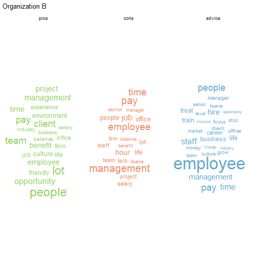
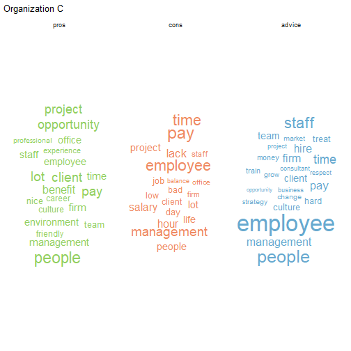
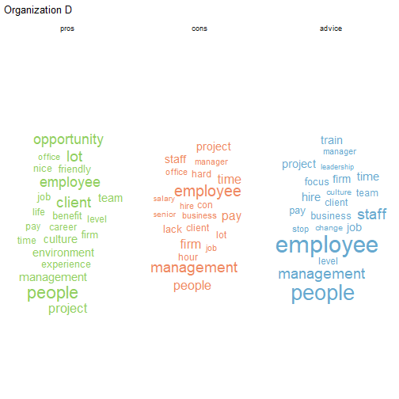

```r
library(tidyverse)
library(lubridate)
library(tm)
library(tidytext)
library(widyr)
library(wordcloud2)
library(textstem)
library(ggwordcloud)
library(lexicon)
library(textdata)
library(stringr)
library(cld2)
library(caTools)
```


```r
load("./glassDoor.RData")
```

## Clean and Explore

The dataset contains GlassDoor reviews for four organizations. Reviews are separated into pros, cons, and advice.  

Problems with text:  
organization name mixed in words, eg. ChORGAllenging  
Non-english reviews  

```r
gdMixed <- glassDoor %>% 
  filter((str_detect(pros, "[^\\s]+ORG[A-D][^\\s]+"))|
           (str_detect(cons, "[^\\s]+ORG[A-D][^\\s]+"))|
           (str_detect(advice, "[^\\s]+ORG[A-D][^\\s]+")))
rmarkdown::paged_table(gdMixed)
```

```
## Error in print.paged_df(x, ...): unused argument (options = options)
```

```r
gdNonEng <- glassDoor %>% 
  mutate(language = cld2::detect_language(pros)) %>% 
  filter(language != "en") %>% 
  dplyr::select(pros, cons, advice, language)
rmarkdown::paged_table(gdNonEng)
```

```
## Error in print.paged_df(x, ...): unused argument (options = options)
```

They are only about 10% of the rows. Deleting them won't affect the result too much. The 36 rows of mixed word errors exhibits no pattern of the replaced letters. We may fuzzy join these words with a english dictionary and replace them. For the non-english reviews, not sure how well the translators perform in R, might just ignore them as well.


```r
gd2 <- glassDoor %>% 
  filter(!(str_detect(pros, "[^\\s]+ORG[A-D][^\\s]+"))) %>% 
  filter(!(str_detect(cons, "[^\\s]+ORG[A-D][^\\s]+"))) %>% 
  filter(!(str_detect(advice, "[^\\s]+ORG[A-D][^\\s]+")) | is.na(advice)) %>% 
  mutate(language = cld2::detect_language(pros)) %>% 
  filter(language == "en") %>% 
  mutate(organization = as.factor(organization),
         pros = gsub("([a-z])([A-Z])", "\\1 \\2", pros),
         cons = gsub("([a-z])([A-Z])", "\\1 \\2", cons),
         advice = gsub("([a-z])([A-Z])", "\\1 \\2", advice),
         rating = fct_relevel(rating, "5.0", "4.0", "3.0", "2.0")) 

str(gd2)
```

```
## 'data.frame':	1682 obs. of  11 variables:
##  $ pros                   : chr  "Good learning opportunities - a mixture of strategy and banking technology projects Smart people to work with a"| __truncated__ "- Excellent projects- Several growth opportunities" "Like the co-worker I work with." "Exposure to many different sectors" ...
##  $ cons                   : chr  "Lack of structure sometimes and unplanned" "- Work life balance is considerably poor as compared to industry standards" "Takes more time than expected" "Often requires you to stay late" ...
##  $ advice                 : chr  NA NA "Listen to the workers doing the hands on work." NA ...
##  $ rating                 : Factor w/ 5 levels "5.0","4.0","3.0",..: 2 3 3 2 1 3 4 4 1 2 ...
##  $ workLifeRating         : Factor w/ 9 levels "1.0","3.0","2.0",..: NA 1 2 NA 3 3 NA 1 4 2 ...
##  $ cultureValueRating     : Factor w/ 9 levels "2.0","3.0","1.0",..: NA 1 2 NA 2 3 NA 1 4 2 ...
##  $ careerOpportunityRating: Factor w/ 8 levels "4.0","2.0","3.0",..: NA 1 2 NA 1 2 NA 2 1 1 ...
##  $ compBenefitsRating     : Factor w/ 9 levels "2.0","1.0","5.0",..: NA 1 1 NA 1 1 NA 2 3 4 ...
##  $ managementRating       : Factor w/ 5 levels "2.0","3.0","4.0",..: NA 1 2 NA 3 4 NA 4 5 3 ...
##  $ organization           : Factor w/ 4 levels "ORGA","ORGB",..: 2 4 3 2 3 4 1 4 2 1 ...
##  $ language               : chr  "en" "en" "en" "en" ...
```

## Visualization


### Organization A

```r
orga <- gd2 %>% 
  filter(organization == "ORGA") %>% 
  dplyr::select(pros, cons, advice) %>% 
  pivot_longer(., cols = colnames(.), names_to = "type", values_to = "text") %>% 
  mutate(type = as.factor(type)) %>% 
  mutate(type = fct_relevel(type, "pros", "cons")) %>% 
  drop_na(text) %>% 
  mutate(text = str_replace_all(text, "ORGA", ""),
         text = tolower(text),
         text = lemmatize_strings(text),
         text = stripWhitespace(text),
         text = removeNumbers(text))  

tokena <-  orga %>% 
  unnest_tokens(word, text) %>% 
  anti_join(stop_words) %>% 
  left_join(parts_of_speech) %>% 
  filter(pos == "Noun" & word != "company") %>% 
  group_by(type) %>% 
  count(word) %>% 
  mutate(freq = n/sum(n)) %>% 
  top_n(n = 20, wt = freq)

tokena %>% 
  ggplot(aes(label = word, size = freq,
             color = type))+
  geom_text_wordcloud_area()+
  scale_size_area(max_size = 12)+
  theme_minimal()+
  scale_color_manual(values = c("pros"="#91cf60", "cons" = "#ef8a62", "advice"="#67a9cf"))+
  facet_wrap(~type)+
  labs(title = "Organization A")
```


### Organization B


### Organization C


### Organization D


It seems words such as "people", "management", "employee", "pay", appears in all pros, cons, and advice in all four companies' reviews. How come people love and hate the same aspect about the same company? We need to take a deeper dive in the future.


## Sentiment Analyses

We are going to do sentiment analyses on Pros, Cons, and Advice separately. Using functions from `sentimentr`, and applying *jocker* polarity table (ranges from -1 to 1) and *hash_valence_shifters*, we can get the sentiment for each reviews. Then we can aggregate the sentiments by rating or company.


### Sentiment of Pros

```r
library(sentimentr)
library(lexicon)
library(magrittr)
prosDF <- gd2 %>% 
  dplyr::select(pros, rating, organization) %>% 
  mutate(pros = str_replace_all(pros, "ORG[A-D]", ""),
         pros = str_replace_all(pros, "[\\.\\!\\?]", ""),
         pros = tolower(pros),
         pros = lemmatize_strings(pros),
         pros = stripWhitespace(pros),
         pros = removeNumbers(pros))  

proSenti = sentiment(get_sentences(prosDF), 
          polarity_dt = lexicon::hash_sentiment_jockers,
          valence_shifters_dt = lexicon::hash_valence_shifters)

## aggregate by company
proSenti %>% 
  group_by(organization) %>% 
  summarize(meanSentiment = mean(sentiment))
```

```
## # A tibble: 4 x 2
##   organization meanSentiment
##   <fct>                <dbl>
## 1 ORGA                 0.582
## 2 ORGB                 0.577
## 3 ORGC                 0.580
## 4 ORGD                 0.589
```

The sentiments in *Pros* reviews for each company are not too different with ORGD taking a slight lead. 


```r
## aggregate sentiment by rating
proSenti %>% 
  group_by(rating) %>% 
  summarize(meanSentiment = mean(sentiment))
```

```
## # A tibble: 5 x 2
##   rating meanSentiment
##   <fct>          <dbl>
## 1 5.0            0.708
## 2 4.0            0.681
## 3 3.0            0.577
## 4 2.0            0.482
## 5 1.0            0.258
```

It is within expectation. Higher rated reviews have more positive words.


```r
## aggregate by both company and rating
proSenti %>% 
  group_by(organization, rating) %>% 
  summarize(meanSentiment = mean(sentiment)) %>% 
  ggplot(aes(x = rating, y = meanSentiment, fill = organization))+
  geom_col()+
  facet_wrap(~organization)+
  geom_text(aes(label = round(meanSentiment,2)), vjust = -0.2)+
  theme_minimal()+
  theme(panel.grid.major = element_blank(),
        axis.text.y = element_blank(),
        legend.position = "none")
```


Within companies, we can still observe that sentiment goes down as rating decreases.

### Sentiment of Cons

Using the same method on *Cons*

```
## # A tibble: 4 x 2
##   organization meanSentiment
##   <fct>                <dbl>
## 1 ORGA                0.0449
## 2 ORGB                0.0574
## 3 ORGC                0.0310
## 4 ORGD                0.0712
```

```
## # A tibble: 5 x 2
##   rating meanSentiment
##   <fct>          <dbl>
## 1 5.0           0.111 
## 2 4.0           0.0857
## 3 3.0           0.0228
## 4 2.0          -0.0124
## 5 1.0          -0.0409
```


Of course the sentiment scores for *Cons* are much lower, sometime even negative. But they have similar pattern as *Pros*. And range of the scores is much smaller than *Pros*. People left more positive words for ORGD again in *Cons*.

### Sentiment of Advice

```
## # A tibble: 4 x 2
##   organization meanSentiment
##   <fct>                <dbl>
## 1 ORGA                 0.177
## 2 ORGB                 0.154
## 3 ORGC                 0.184
## 4 ORGD                 0.198
```

```
## # A tibble: 5 x 2
##   rating meanSentiment
##   <fct>          <dbl>
## 1 5.0            0.193
## 2 4.0            0.194
## 3 3.0            0.171
## 4 2.0            0.193
## 5 1.0            0.124
```


*Advice* is more positive than *Cons*. However, the sentiment score do not decrease as rating decrease when rating >= 2. Again, ORGD reveives more positive words on *Advice*. It seems people speak positively in all three kinds of reviews in ORGD.

## Topic Models


```r
gd3 <- gd2 %>% 
  dplyr::select(pros, cons, advice, rating, organization) %>% 
  drop_na(c(pros, cons, advice)) %>% 
  mutate(text = str_c(pros, cons, advice, sep = " ")) %>% 
  dplyr::select(rating, organization, text)
```


```r
library(stm)

set.seed(1234)

holdoutRows = sample(1:nrow(gd3), 100, replace = FALSE)

gdText = textProcessor(documents = gd3$text[-c(holdoutRows)], 
                          metadata = gd3[-c(holdoutRows), ], 
                          stem = FALSE)
```

```
## Building corpus... 
## Converting to Lower Case... 
## Removing punctuation... 
## Removing stopwords... 
## Removing numbers... 
## Creating Output...
```


```r
gdPrep = prepDocuments(documents = gdText$documents, 
                               vocab = gdText$vocab,
                               meta = gdText$meta)
```

```
## Removing 3882 of 7056 terms (3882 of 39296 tokens) due to frequency 
## Your corpus now has 992 documents, 3174 terms and 35414 tokens.
```


```r
kTest = searchK(documents = gdPrep$documents, 
             vocab = gdPrep$vocab, 
             K = c(3, 4, 5, 10, 20), verbose = FALSE)

# png(file = "./ktest1new.png", width = 800, height = 600)
# plot(kTest)
# dev.off()
```


Looks like 4 is a reasonable number of topics.  

Now let's look at expected topic proportions.  


```r
topics4 = stm(documents = gdPrep$documents, 
             vocab = gdPrep$vocab, seed = 1001,
             K = 4, verbose = FALSE)


plot(topics4)
```


```r
labelTopics(topics4)
```

```
## Topic 1 Top Words:
##  	 Highest Prob: work, good, great, people, environment, can, benefits 
##  	 FREX: lots, students, learning, interns, school, key, open 
##  	 Lift: achievement, allocation, alternate, application, archaic, assortment, aug 
##  	 Score: good, lots, friendly, learning, great, environment, flexible 
## Topic 2 Top Words:
##  	 Highest Prob: company, will, employees, people, dont, get, work 
##  	 FREX: please, anything, worst, month, horrible, tell, wrong 
##  	 Lift: -called, -hour, -site, absence, absolute, accepting, actions 
##  	 Score: worst, half, tell, rep, horrible, property, quit 
## Topic 3 Top Words:
##  	 Highest Prob: work, projects, firm, consulting, culture, senior, clients 
##  	 FREX: firm, firms, interesting, partners, brand, terms, junior 
##  	 Lift: abroad, allowance, amazingly, ambitious, analytical, asia, asian 
##  	 Score: firm, projects, consulting, firms, exposure, consultants, partners 
## Topic 4 Top Words:
##  	 Highest Prob: company, staff, management, employees, new, employee, training 
##  	 FREX: community, values, tasks, amazing, administration, fantastic, loyalty 
##  	 Lift: ’ve, abilities, absorb, accounting, accounts, achievements, acquired 
##  	 Score: staff, leadership, community, communities, federal, fair, upper
```

From highest prob and FREX words, we can see the difference between the 5 topics. It seems topic 1 is compliment of the work at the company. Topic 2 is about pay and benefits. Topic 3 is about the cons of the company. Topic 4 is about professional experience.


```r
head(topics4$theta, 15)
```

```
##            [,1]       [,2]       [,3]       [,4]
##  [1,] 0.1756340 0.66551173 0.05017709 0.10867716
##  [2,] 0.2649366 0.02862035 0.63888994 0.06755310
##  [3,] 0.3073273 0.35936017 0.29633838 0.03697412
##  [4,] 0.5645380 0.04787455 0.28583712 0.10175032
##  [5,] 0.4298070 0.23965697 0.07805118 0.25248484
##  [6,] 0.1784487 0.01460559 0.77973885 0.02720691
##  [7,] 0.1942635 0.02574412 0.72010407 0.05988827
##  [8,] 0.1358200 0.01854973 0.80976235 0.03586792
##  [9,] 0.1223953 0.01314036 0.84045773 0.02400658
## [10,] 0.2252693 0.30645612 0.33078665 0.13748797
## [11,] 0.3098211 0.32400444 0.17645013 0.18972433
## [12,] 0.3886456 0.21431376 0.29767919 0.09936142
## [13,] 0.6546003 0.11750467 0.15689051 0.07100456
## [14,] 0.1894023 0.01356781 0.76456404 0.03246589
## [15,] 0.3449836 0.03223478 0.57542942 0.04735223
```

We can see some documents have a more focused topic, and some documents span different topics.    
  
Let's use the model to classify heldout documents  


```r
newgdText = textProcessor(documents = gd3$text[holdoutRows], 
                          metadata = gd3[holdoutRows, ], 
                          stem = FALSE)
```

```
## Building corpus... 
## Converting to Lower Case... 
## Removing punctuation... 
## Removing stopwords... 
## Removing numbers... 
## Creating Output...
```


```r
newgdCorp = alignCorpus(new = newgdText, old.vocab = topics4$vocab)
```

```
## Your new corpus now has 100 documents, 1447 non-zero terms of 2268 total terms in the original set. 
## 821 terms from the new data did not match.
## This means the new data contained 45.6% of the old terms
## and the old data contained 63.8% of the unique terms in the new data. 
## You have retained 4812 tokens of the 5714 tokens you started with (84.2%).
```

```r
newgdFitted = fitNewDocuments(model = topics4, documents = newgdCorp$documents, 
                newData = newgdCorp$meta, origData = gdPrep$meta)
```

```
## ....................................................................................................
```


```r
head(newgdFitted$theta, 15)
```

```
##             [,1]       [,2]       [,3]       [,4]
##  [1,] 0.21361860 0.23759019 0.10873902 0.44005218
##  [2,] 0.44609139 0.41309024 0.05770793 0.08311044
##  [3,] 0.25195379 0.45196056 0.06599594 0.23008971
##  [4,] 0.33911532 0.41491338 0.06179325 0.18417805
##  [5,] 0.19376840 0.12010528 0.44704999 0.23907632
##  [6,] 0.31905012 0.44809372 0.12579906 0.10705710
##  [7,] 0.17279768 0.35462032 0.07645427 0.39612773
##  [8,] 0.21067426 0.58780508 0.09953192 0.10198875
##  [9,] 0.29057213 0.05123786 0.15904898 0.49914104
## [10,] 0.36374866 0.29886380 0.05026104 0.28712650
## [11,] 0.20227397 0.69334832 0.03801047 0.06636724
## [12,] 0.20646682 0.38924165 0.04159133 0.36270020
## [13,] 0.55030704 0.12288921 0.21417721 0.11262655
## [14,] 0.39643243 0.08474309 0.10712628 0.41169821
## [15,] 0.09463731 0.64928810 0.08666505 0.16940954
```


## Predict ratings with text feature

Let's see if any topic proportion is related to rating.  


```r
gd3 <- gd3 %>% 
  mutate(rating = as.numeric(as.character(rating)))
predictorText = textProcessor(documents = gd3$text, 
                          metadata = gd3, 
                          stem = FALSE)
```

```
## Building corpus... 
## Converting to Lower Case... 
## Removing punctuation... 
## Removing stopwords... 
## Removing numbers... 
## Creating Output...
```

```r
gdPrep = prepDocuments(documents = predictorText$documents, 
                               vocab = predictorText$vocab,
                               meta = predictorText$meta)
```

```
## Removing 4202 of 7632 terms (4202 of 44161 tokens) due to frequency 
## Your corpus now has 1092 documents, 3430 terms and 39959 tokens.
```

```r
topicPredictor = stm(documents = gdPrep$documents,
             vocab = gdPrep$vocab, prevalence = ~ rating,
             data = gdPrep$meta, K = 4, verbose = FALSE)

ratingEffect = estimateEffect(1:4 ~ rating, stmobj = topicPredictor,
               metadata = gdPrep$meta)

summary(ratingEffect, topics = c(1:4))
```

```
## 
## Call:
## estimateEffect(formula = 1:4 ~ rating, stmobj = topicPredictor, 
##     metadata = gdPrep$meta)
## 
## 
## Topic 1:
## 
## Coefficients:
##             Estimate Std. Error t value Pr(>|t|)    
## (Intercept) 0.194394   0.019446   9.996   <2e-16 ***
## rating      0.006213   0.005581   1.113    0.266    
## ---
## Signif. codes:  0 '***' 0.001 '**' 0.01 '*' 0.05 '.' 0.1 ' ' 1
## 
## 
## Topic 2:
## 
## Coefficients:
##              Estimate Std. Error t value Pr(>|t|)    
## (Intercept)  0.431551   0.020087  21.484  < 2e-16 ***
## rating      -0.037651   0.005587  -6.739 2.57e-11 ***
## ---
## Signif. codes:  0 '***' 0.001 '**' 0.01 '*' 0.05 '.' 0.1 ' ' 1
## 
## 
## Topic 3:
## 
## Coefficients:
##              Estimate Std. Error t value Pr(>|t|)    
## (Intercept)  0.466934   0.018446   25.31   <2e-16 ***
## rating      -0.084882   0.004985  -17.03   <2e-16 ***
## ---
## Signif. codes:  0 '***' 0.001 '**' 0.01 '*' 0.05 '.' 0.1 ' ' 1
## 
## 
## Topic 4:
## 
## Coefficients:
##              Estimate Std. Error t value Pr(>|t|)    
## (Intercept) -0.092354   0.014687  -6.288 4.64e-10 ***
## rating       0.116199   0.004426  26.252  < 2e-16 ***
## ---
## Signif. codes:  0 '***' 0.001 '**' 0.01 '*' 0.05 '.' 0.1 ' ' 1
```


```r
plot.estimateEffect(ratingEffect, "rating", method = "continuous",
                    model = topicPredictor, topics = 1, labeltype = "frex")
```


```r
plot.estimateEffect(ratingEffect, "rating", method = "continuous",
                    model = topicPredictor, topics = 2, labeltype = "frex")
```


```r
plot.estimateEffect(ratingEffect, "rating", method = "continuous",
                    model = topicPredictor, topics = 3, labeltype = "frex")
```


```r
plot.estimateEffect(ratingEffect, "rating", method = "continuous",
                    model = topicPredictor, topics = 4, labeltype = "frex")
```


Looks like ratings are associated with topic proportions. Except topic 1 not so significant.


```r
thetas=topicPredictor$theta
```

It seems that these topic are related to rating. On the other hand, We may use them to predict ratings.  
  
We are going to use sentiments and topic thetas to predict ratings.  

```r
proSenti <- proSenti %>% 
  rename(c("proSentiment"="sentiment"))

conSenti <- consenti %>% 
  rename(c("conSentiment"="sentiment"))

adviceSenti <- adviceSenti %>% 
  rename(c("adviceSentiment"="sentiment"))

gd4 <- gd2 %>% 
  mutate(proSentiment = proSenti$proSentiment,
         conSentiment = conSenti$conSentiment,
         adviceSentiment = adviceSenti$adviceSentiment) %>% 
  drop_na(c(pros, cons, advice)) %>% 
  mutate(topic1theta = thetas[,1],
         topic2theta = thetas[,2],
         topic3theta = thetas[,3],
         topic4theta = thetas[,4])
```

Split into training and testing sets  

```r
gd5 <- gd4 %>% 
  dplyr::select(rating, proSentiment, conSentiment, adviceSentiment, 
         topic1theta, topic2theta, topic3theta, topic4theta, organization) %>% 
  mutate(rating = as.numeric(as.character(rating)))
sample_set <- gd5 %>% 
  pull(.) %>% 
  sample.split(SplitRatio = .7)

gdTrain <- subset(gd5, sample_set == TRUE)
gdTest <- subset(gd5, sample_set == FALSE)
```

Let's try linear model first  

```r
lmod <- lm(rating~proSentiment+ conSentiment+ adviceSentiment+ 
         topic1theta+ topic2theta+ topic3theta, data=gd5)
summary(lmod)
```

```
## 
## Call:
## lm(formula = rating ~ proSentiment + conSentiment + adviceSentiment + 
##     topic1theta + topic2theta + topic3theta, data = gd5)
## 
## Residuals:
##      Min       1Q   Median       3Q      Max 
## -3.03007 -0.64274 -0.05801  0.60607  2.84685 
## 
## Coefficients:
##                 Estimate Std. Error t value Pr(>|t|)    
## (Intercept)      5.92017    0.11706  50.576  < 2e-16 ***
## proSentiment     0.31920    0.06770   4.715 2.74e-06 ***
## conSentiment     0.05862    0.08530   0.687    0.492    
## adviceSentiment -0.01734    0.07766  -0.223    0.823    
## topic1theta     -3.45484    0.16038 -21.542  < 2e-16 ***
## topic2theta     -3.90417    0.14971 -26.078  < 2e-16 ***
## topic3theta     -5.04814    0.15290 -33.016  < 2e-16 ***
## ---
## Signif. codes:  0 '***' 0.001 '**' 0.01 '*' 0.05 '.' 0.1 ' ' 1
## 
## Residual standard error: 0.8988 on 1085 degrees of freedom
## Multiple R-squared:  0.6218,	Adjusted R-squared:  0.6197 
## F-statistic: 297.3 on 6 and 1085 DF,  p-value: < 2.2e-16
```

Remove insignificant variables.


```r
lmod2 <- lm(rating~proSentiment+topic1theta+topic2theta+topic3theta, data=gd5)
summary(lmod2)
```

```
## 
## Call:
## lm(formula = rating ~ proSentiment + topic1theta + topic2theta + 
##     topic3theta, data = gd5)
## 
## Residuals:
##      Min       1Q   Median       3Q      Max 
## -3.02933 -0.64331 -0.05322  0.60442  2.87685 
## 
## Coefficients:
##              Estimate Std. Error t value Pr(>|t|)    
## (Intercept)   5.92554    0.11138  53.202  < 2e-16 ***
## proSentiment  0.32047    0.06748   4.749 2.32e-06 ***
## topic1theta  -3.46199    0.15988 -21.654  < 2e-16 ***
## topic2theta  -3.91761    0.14631 -26.777  < 2e-16 ***
## topic3theta  -5.05671    0.14762 -34.255  < 2e-16 ***
## ---
## Signif. codes:  0 '***' 0.001 '**' 0.01 '*' 0.05 '.' 0.1 ' ' 1
## 
## Residual standard error: 0.8982 on 1087 degrees of freedom
## Multiple R-squared:  0.6217,	Adjusted R-squared:  0.6203 
## F-statistic: 446.5 on 4 and 1087 DF,  p-value: < 2.2e-16
```

Adj. R-squared is 0.6203, not too bad.  


```r
lmPred <- predict(lmod2, gdTest)
lmPred_round <- ifelse(lmPred <=1.0, 1.0, lmPred)
lmPred_round <- ifelse(lmPred_round >=5.0, 5.0, lmPred_round)
lmPred_round <- round(lmPred_round)
table(lmPred_round, gdTest$rating)
```

```
##             
## lmPred_round  1  2  3  4  5
##            1 18  4  0  1  0
##            2 44 10 12  1  1
##            3  9 20 41 38 13
##            4  1  2 14 25 26
##            5  0  0  2 13 32
```

```r
mean(as.character(lmPred_round) != as.character(gdTest$rating))
```

```
## [1] 0.6146789
```

There are a lot of wrong prediction in the test data. But the predictions are not too far off. Most predictions are within 1.0 points range around the actuals. A 59% of the test data is missclassified.  
  
Multinomial logistic regression  
  
Since the ratings are discrete, let's see how a multinomial logistic regression performs.


```r
gd5_factor <- gd4 %>% 
  dplyr::select(rating, proSentiment, conSentiment, adviceSentiment, 
         topic1theta, topic2theta, topic3theta, topic4theta, organization)

set.seed(1234)
sample_set <- gd5_factor %>% 
  pull(.) %>% 
  sample.split(SplitRatio = .7)

gdTrain <- subset(gd5_factor, sample_set == TRUE)
gdTest <- subset(gd5_factor, sample_set == FALSE)

library(MASS)
```

```
## Warning: package 'MASS' was built under R version 3.6.2
```

```
## 
## Attaching package: 'MASS'
```

```
## The following object is masked from 'package:dplyr':
## 
##     select
```

```r
ordModel <- polr(rating~proSentiment+topic1theta+topic2theta+topic3theta, data=gd5_factor, Hess = TRUE)
summary (ordModel) 
```

```
## Call:
## polr(formula = rating ~ proSentiment + topic1theta + topic2theta + 
##     topic3theta, data = gd5_factor, Hess = TRUE)
## 
## Coefficients:
##                Value Std. Error t value
## proSentiment -0.8024     0.1590  -5.048
## topic1theta   8.0278     0.4497  17.853
## topic2theta   8.7015     0.4355  19.979
## topic3theta  11.0001     0.4806  22.888
## 
## Intercepts:
##         Value   Std. Error t value
## 5.0|4.0  3.8144  0.2961    12.8839
## 4.0|3.0  5.8562  0.3348    17.4898
## 3.0|2.0  7.5522  0.3657    20.6489
## 2.0|1.0  8.6461  0.3834    22.5500
## 
## Residual Deviance: 2401.442 
## AIC: 2417.442
```


```r
predicted_scores <- predict (ordModel, gdTest, "probs") 

predicted_class <- predict (ordModel, gdTest)

table(predicted_class, gdTest$rating)
```

```
##                
## predicted_class 5.0 4.0 3.0 2.0 1.0
##             5.0  39  23   3   0   0
##             4.0  31  23  18   4   1
##             3.0   6  25  37  17   9
##             2.0   0   0   0   0   0
##             1.0   1   3   6  10  71
```

```r
mean(as.character(predicted_class) != as.character(gdTest$rating))
```

```
## [1] 0.4801223
```

It improved a litte with a missclassification rate of 48%.  
  
There is still a lot of room to improve the model to predict the rating. Here, we are only using text features such as sentiment and topic thetas. We can add other rating in the model or add some interactions with organization. We can try mixed model, too. Using more complexed model may improve the performance.
